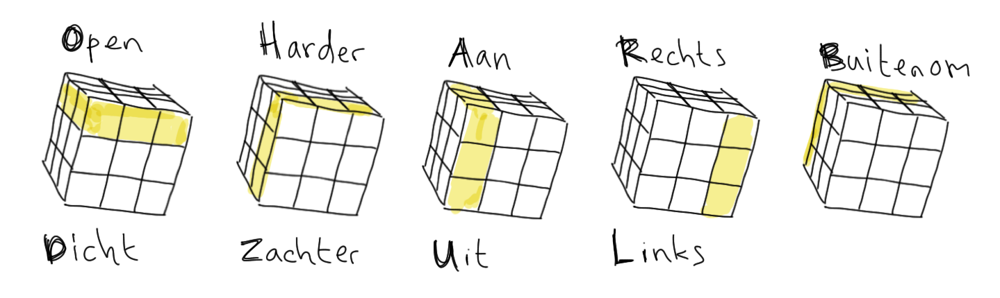
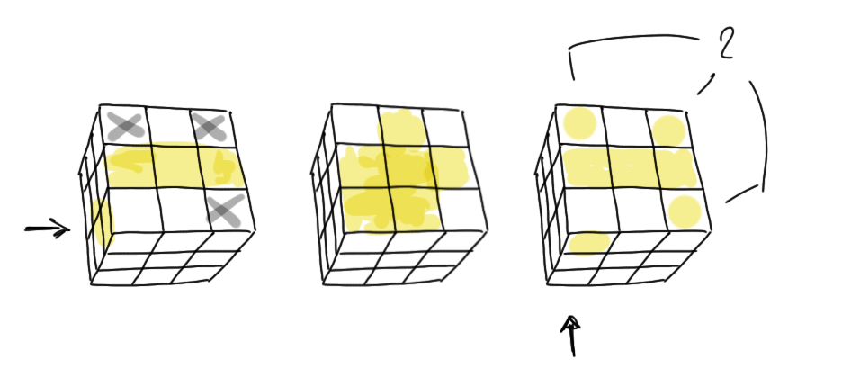

# kubus

Ezelsbruggetjes om de Rubik's kubus op te lossen.

Hallo ik ben Julius en ik ben 10 jaar en ik kan de Rubik's kubus oplossen. Dat doe je in 7 stappen.

<iframe width="420" height="315" src="http://www.youtube.com/embed/xBG-Y2lBTXY" frameborder="0" allowfullscreen></iframe>

## Het draaien
`O`pen - `D`icht, `H`arder - `Z`achter `A`an - `U`it `R`echts - `L`inks en `B`uitenom geven de draairichting aan. Boven staat met de klok mee, eronder tegen de klok in.  

## Stap 1 - Het witte kruis

## Stap 2 - Het witte vlak

## Stap 3 - De tweede laag

Naar rechts
- `ORD`e`L`ijk `D`e`Z`e `O`p`H`ef

Naar links
- `DU`s `O`p`A`? `O`c`H` `D`e`Z`e

## Stap 4 - Het gele kruis

- `HORD`e `L`in`Z`en
- `H`e`RO`s `L`ee`D`we`Z`en, of
- `H`e`R`ten w`OL` `D`e`Z`e  

## Stap 5 - Het gele vlak

Kubus vasthouden zoals op het plaatje, afhankelijk of er 0, 1, of 2 hoeken al goed zitten. 

- `ROLO` `R`i`OOL`

## Stap 6 - De juiste hoeken

- `L`ic`H`t g`L`i`BB`e`R` `Z`eg g`L`i`BB`e`R` gRinD

## Stap 7 - Het juiste midden

- `H`i`H`i g`OAL` `H`i`H`i e`URO` `H`i`H`i

## Historie
Vroeger gebruikten we andere zinnetjes. 
- VeeBoeR Bijt RietVink
- VeRfBom Rij BierVis
- RouwBeRicht Boerenbord BRief
- RietVeld RijpAARd Vis RijpAARd RoBijn
- VoetVeeg BoomLeeuweRik  VoetVeeg Linkerbeen Voetveeg
